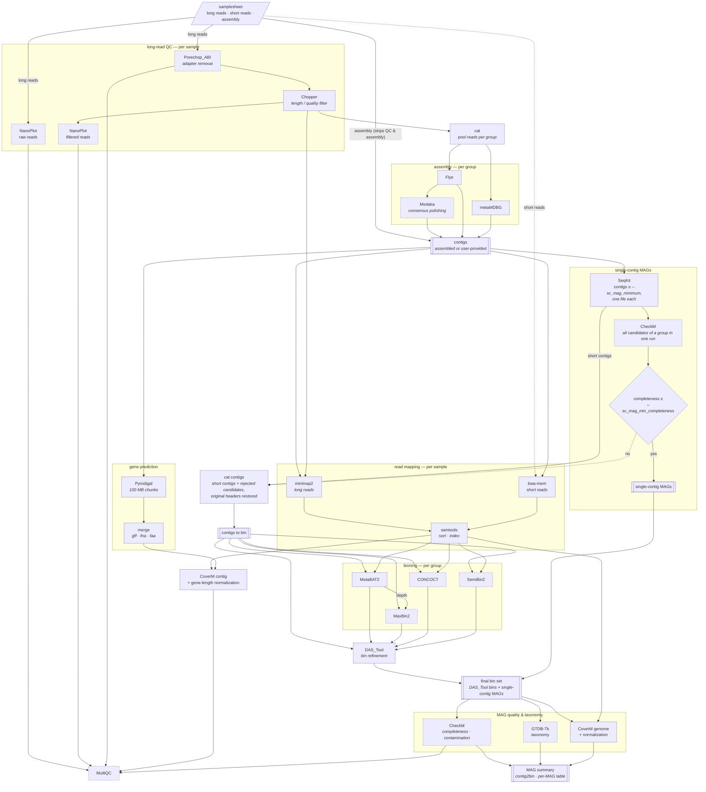

[](https://www.nextflow.io/)
[](https://github.com/nf-core/tools/releases/tag/4.1.0)
[](https://docs.conda.io/en/latest/)
[](https://www.docker.com/)
[](https://sylabs.io/docs/)

```
                                         _
 _ __ ___   __ _  __ _        ___  _ __ | |_
| '_ ` _ \ / _` |/ _` |_____ / _ \| '_ \| __|
| | | | | | (_| | (_| |_____| (_) | | | | |_
|_| |_| |_|\__,_|\__, |      \___/|_| |_|\__|
                 |___/

Long reads-first metagenome assembly and binning
with support for short reads

     Github: https://github.com/dsamoht/mag-ont
     Version: v1.4.0
```

## pipeline overview



*Dashed boxes are optional steps that can be turned off with the matching `--skip_*` parameter.*

## TL;DR

```bash
nextflow run main.nf \
  -profile singularity,drac \
  --gtdbtk_db /path/to/uncompressed/db \
  --input ./tests/data/samplesheet_test.csv \
  --outdir ./tests/outdir
```

## software dependencies

- [Nextflow](https://www.nextflow.io/)
- [Docker](https://www.docker.com/) or [Apptainer (Singularity)](https://apptainer.org/)

## database

- [GTDB-Tk database - release 226](https://ecogenomics.github.io/GTDBTk/installing/index.html#gtdb-tk-reference-data) (uncompressed)

## usage

select :

1. a container engine : `docker`, `singularity`, `apptainer`, `podman`, `shifter`, `charliecloud` or `wave` (`conda`/`mamba` are also available). Most HPC environments have apptainer already installed. Docker is mostly used on local workstations.
2. optionally, an execution profile : `test` runs a minimal dataset to check your installation, `drac` runs with the slurm executor on the Digital Research Alliance of Canada clusters or similar slurm-based HPC, and `gpu` passes a GPU through to Medaka and SemiBin2. With no execution profile the pipeline runs locally with the default resources from [conf/base.config](./conf/base.config).

Resource requests and tool arguments can be overridden with your own config, see [docs/usage.md](./docs/usage.md).

```bash
nextflow run main.nf \
  -profile {docker/singularity/apptainer}[,test][,drac] \
  --gtdbtk_db /path/to/uncompressed/db \
  --input ./tests/data/samplesheet_test.csv \
  --outdir ./tests/outdir
```

Full documentation: [usage](./docs/usage.md) and [output](./docs/output.md).

## sample sheet specification

The pipeline uses a CSV sample sheet to manage input data and define how samples are grouped for co-assembly and binning.

The CSV must contain exactly **6 columns** with the following headers:

| column         | description                                                                                                      |
| -------------- | ---------------------------------------------------------------------------------------------------------------- |
| sample_id      | unique name for the sample.                                                                                      |
| group          | identifier to group samples together for co-processing. All samples that share this identifier are co-assembled. |
| assembly_fasta | path to a pre-existing assembly. If provided, assembly is skipped and the pipeline starts at the binning step.   |
| long_reads     | path to long-read FASTQ file.                                                                                    |
| short_reads_1  | path to post-qc forward R1 FASTQ file.                                                                           |
| short_reads_2  | path to post-qc reverse R2 FASTQ file.                                                                           |

> [!NOTE]
> When both types of reads are provided and no pre-existing assembly is provided, assembly is made with the long reads and binning is made with the short reads.
> Short reads are only used for binning and they are chosen over long reads.

- **Read consistency:** Short reads must be paired. If short_reads_1 is provided, short_reads_2 must also be provided.
- **Minimum requirements:** Each group must contain at least an assembly_fasta OR long_reads.
- **Group integrity:** All samples within the same group must point to the **exact same** assembly_fasta if a pre-existing assembly is provided.
- **Read type matching:** Within a group, you cannot mix "long-read only" samples with "short-read only" samples. This ensures compatibility during binning and coverage calculation.

### input example

```csv
sample_id,group,assembly_fasta,long_reads,short_reads_1,short_reads_2
test4,ont_test4,,https://github.com/dsamoht/mag-ont/raw/refs/heads/main/tests/data/TEST4_ONT.fastq.gz,,
test3,ont_test3,https://github.com/dsamoht/mag-ont/raw/refs/heads/main/tests/data/ont_test3.assembly.fasta,https://github.com/dsamoht/mag-ont/raw/refs/heads/main/tests/data/TEST3_ONT.fastq.gz,,
test1,coassembly,https://github.com/dsamoht/mag-ont/raw/refs/heads/main/tests/data/coassembly.assembly.fasta,https://github.com/dsamoht/mag-ont/raw/refs/heads/main/tests/data/TEST3_ONT.fastq.gz,https://github.com/dsamoht/mag-ont/raw/refs/heads/main/tests/data/TEST1_R1.fastq.gz,https://github.com/dsamoht/mag-ont/raw/refs/heads/main/tests/data/TEST1_R2.fastq.gz
test2,coassembly,https://github.com/dsamoht/mag-ont/raw/refs/heads/main/tests/data/coassembly.assembly.fasta,https://github.com/dsamoht/mag-ont/raw/refs/heads/main/tests/data/TEST4_ONT.fastq.gz,https://github.com/dsamoht/mag-ont/raw/refs/heads/main/tests/data/TEST2_R1.fastq.gz,https://github.com/dsamoht/mag-ont/raw/refs/heads/main/tests/data/TEST2_R2.fastq.gz
```

## acknowledgement

This pipeline is inspired by [**nf-core/mag**](https://github.com/nf-core/mag) :

> nf-core/mag: a best-practice pipeline for metagenome hybrid assembly and binning  
> Sabrina Krakau, Daniel Straub, Hadrien Gourlé, Gisela Gabernet, Sven Nahnsen.  
> NAR Genom Bioinform. 2022 Feb 2;4(1)
> doi: [10.1093/nargab/lqac007](https://academic.oup.com/nargab/article/4/1/lqac007/6520104)
